# **Task-2**
**Jenkins-Docker**

# **About TASK-2**

**1.** *Create container image that’s has Jenkins installed  using dockerfile.*

**2.** *When we launch this image, it should automatically starts Jenkins service in the container.*

**3.** *Create a job chain of job1, job2, job3 and  job4 using build pipeline plugin in Jenkins.*

**4.**  *Job1 : Pull  the Github repo automatically when some developers push repo to Github.*

**5.**  *Job2 : By looking at the code or program file, Jenkins should automatically start the respective language interpreter install image container to deploy code ( eg. If code is of  PHP, then Jenkins should start the container that has PHP already installed ).*

**6.** *Job3 : Test your app if it  is working or not.*

**7.** *Job4 : if app is not working , then send email to developer with error messages.*

**8.** *Create One extra job job5 for monitor : If container where app is running. fails due to any reson then this job should automatically start the container again.*

# **Before any JOB**
*This is the required dockerfile, the respective image has pre-installed **jenkins** in it. As the jenkins is build on the top of **java** so we have to install **jdk** along with it.*
*The reason we have installed **sudo and wget** is to further install jenkins and run command inside the container.*
*Since **systemctl** by default doesn't work inside container, so we have to use sudo service jenkins --DFOREGROUND start command, and service command isn't pre-installed in Centos:latest image . So, we also installed /sbin/service.*

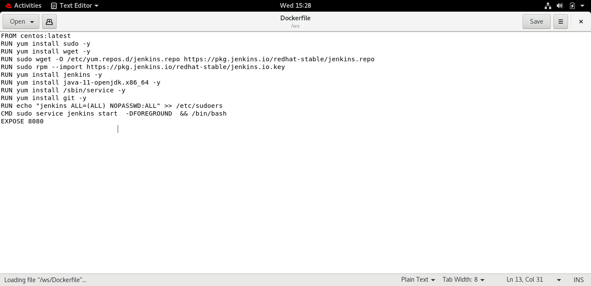

# **JOB 1**

*The task is to pull the **developer code** each time they commit usig **GitHub** and the copy is copied inside the container (location -> /code).*
*The build is trigger using **Trigger build remotely**.*
*The Job name given to this task is **Pull**.*

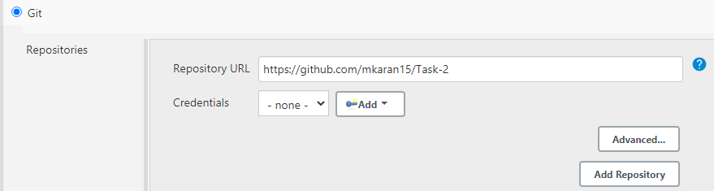

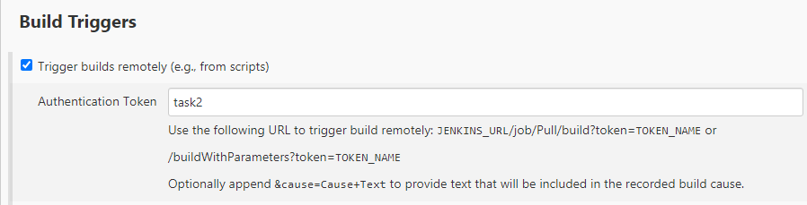

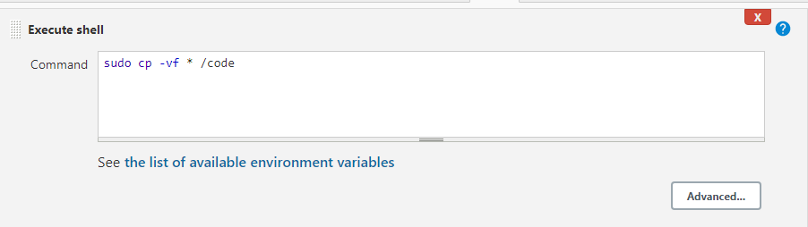

# **Job 2**

*The task is to use **ssh protocol** to transfer the downloaded code to the host OS(RHEL-8)*
*This is done to delpoy code to client using respective image as per the code.*
*This build is trigger only if the **Job1(Pull)** is stable.*
*The name of this job is **Transfer** as it transfer the code from container to Base OS.*

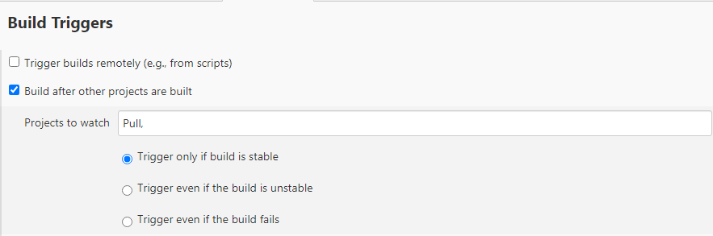

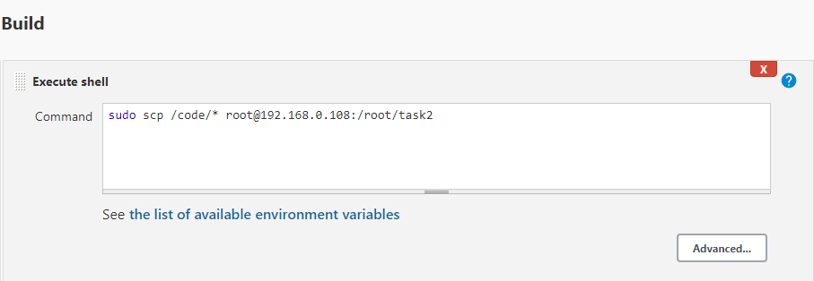

# **Job 3**

*How can be differentitate whether the code is of **HTMl** or **PHP** -> **The extension of code**.* 
*The first condition is made as if the developer changes his mind in-between and **update his code from html to php or from php to html**, the previous container must throw error and for this we deploy new container everytime the developer changes the code and commit the changes.*
*The next condition is to check the extension of code: **1.** if the code is html code it will use **httpd image** to launch container and the respective code is mount to container to the location from where it deploy it to server.*
**2.** *If the code is of PHP it will use **php image** orignal image is **vimal13/apache-webserver-php** i used **docker tag command** to rename it*

*This job has a **Upstream job** which is **Transfer(Job2)**, and the name of this job is **Build**
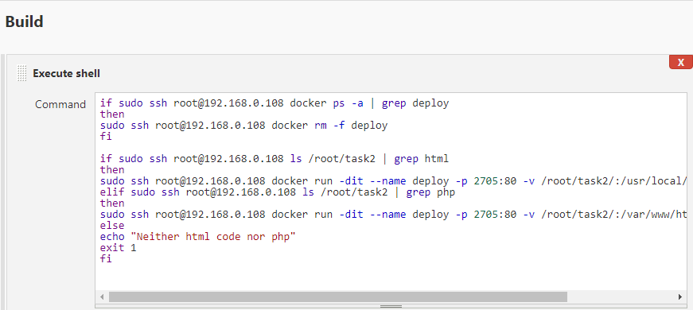

# **Job 4 (name ->Test)**

*It will store the status of the web page and compare it with 200 as the webpage return 200 if the webpage is working fine.*
*If the code give any other status rather than 200 it will throw an error and an email is sent to the developer regarding failure of deploying webpage to client.*

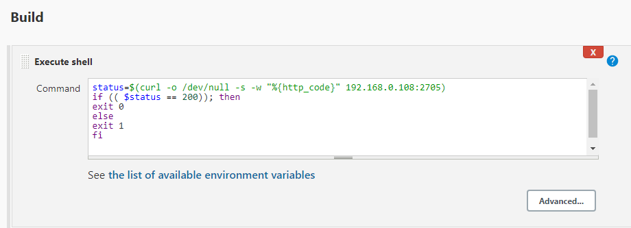

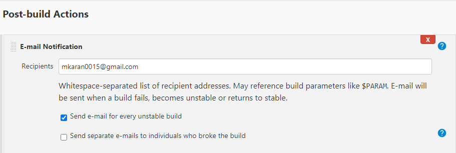

# **Job 5**
*This is to monitor whether the container is running or not, if the container is running fine the job fails and if the container is deleted it will trigger the Job 2(Transfer) and all the jobs from **Trigger to Test** will build again.*

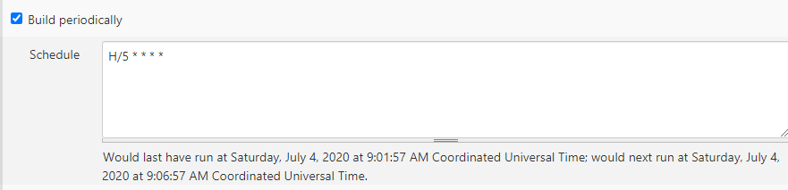

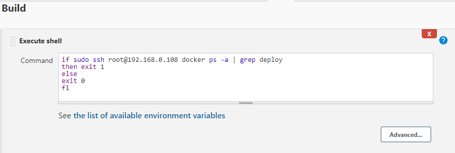

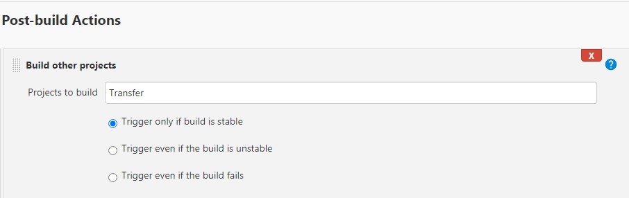

# **All the Jobs for the task after success.**
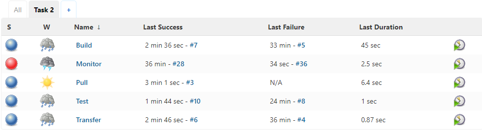

# **The output of the following task.**

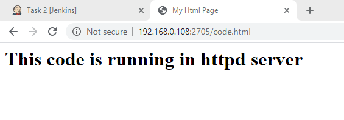

